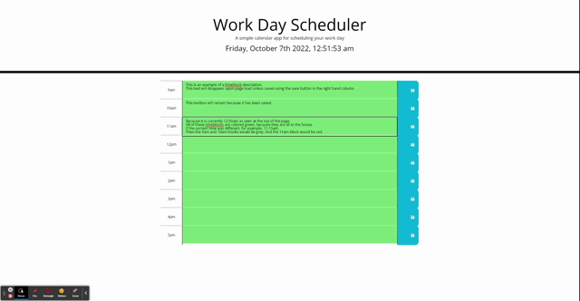

# Work-Day-Scheduler
https://peterkim89.github.io/Work-Day-Scheduler/

## Introduction
This scheduler will let you plan out your work day from 9am to 5pm. According to your current local time, the different time blocks will be color coded on whether that time has passed, has yet to come, or it is currently that time block. Any comments, messages, or data that is saved within a time block's description will remain on the page even after reloading the page. 

## Build Process
- Begin by creating bootstrap containers for a single timeblock
- Extrapolate that container for all hours within a normal business work day
- Reference the css file to add any relevant class names to the containers

- Create a timer at the top of the page using the moment.js api
- Add a setInterval to the timer to keep it self updating
- Create a function that will control the time block colors based on the current time
- Create a function that will allow the save buttons to locally store their respective time block description upon click
- Create a function that will get the data from local storage
- Upon page load, call these functions using a ready function

## Code Snippet
By creating 2 arrays, one containing all of the timeblock html ids and the other containing their respective numerical 24 hour value. I can then use a for loop to iterate through both arrays at once, because they are both the same length. Using the current index of the numerical value array, I can compare each element to the current hour to check to see if it's in the past, present, or future. The respective html class will be added to that element and it's css style will be applied to change it's color. 

```
var timeblockSlots = ["9am","10am","11am","12pm","1pm","2pm","3pm","4pm","5pm"]; // timeblock ids
var timeblockSlot24Hour = [9,10,11,12,13,14,15,16,17]; // timeblock slots converted to their 24 hour values
function colorCode() {
    for (i=0; i<timeblockSlots.length; i++) 
    {
        // if selected timeblock is earlier than current hour, give it the past class and remove present/future classes if they exist
        if (timeblockSlot24Hour[i] < moment().get('hour')) 
        {
            document.getElementById(timeblockSlots[i]).classList.add("past");
            document.getElementById(timeblockSlots[i]).classList.remove("present");
            document.getElementById(timeblockSlots[i]).classList.remove("future");
        }
        // if selected timeblock is equal to the current hour, give it the present class and remove past/future classes if they exist
        else if (timeblockSlot24Hour[i] == moment().get('hour')) 
        {
            document.getElementById(timeblockSlots[i]).classList.remove("past");
            document.getElementById(timeblockSlots[i]).classList.add("present");
            document.getElementById(timeblockSlots[i]).classList.remove("future");
        }
        // if selected timeblock is later than current hour, give it the future class and remove past/present classes if they exist
        else 
        {
            document.getElementById(timeblockSlots[i]).classList.remove("past");
            document.getElementById(timeblockSlots[i]).classList.remove("present");
            document.getElementById(timeblockSlots[i]).classList.add("future");
        }
    }
}
```

## Usage 
Upon initial page load, a timer displaying current local time and a series of rows ranging from 9am to 5pm should appear, segmented into 3 columns. The first column exists to denote that row's specific hour. The second column allows for text to be entered. This is the primary field for you to organize your day with any notes, meetings, reminders, or anything you might need for an effective schedule. The final column contains a button that will save your description field to local storage. Once data has been saved, it will remain until it is changed and overwritten by another save. This will persist through page reloading as well.

<br>

## Languages and Technology
- HTML
- CSS
- JavaScript
- JQuery
- Bootstrap
- Font Awesome

## Author
[GitHub](https://github.com/PeterKim89) <br>
[LinkedIn](www.linkedin.com/in/peter-kim89)   
[Email]Peter.Kim@uconn.edu

## License
[MIT](https://choosealicense.com/licenses/mit/) <br>
Copyright (c) [2022] [Peter Kim]